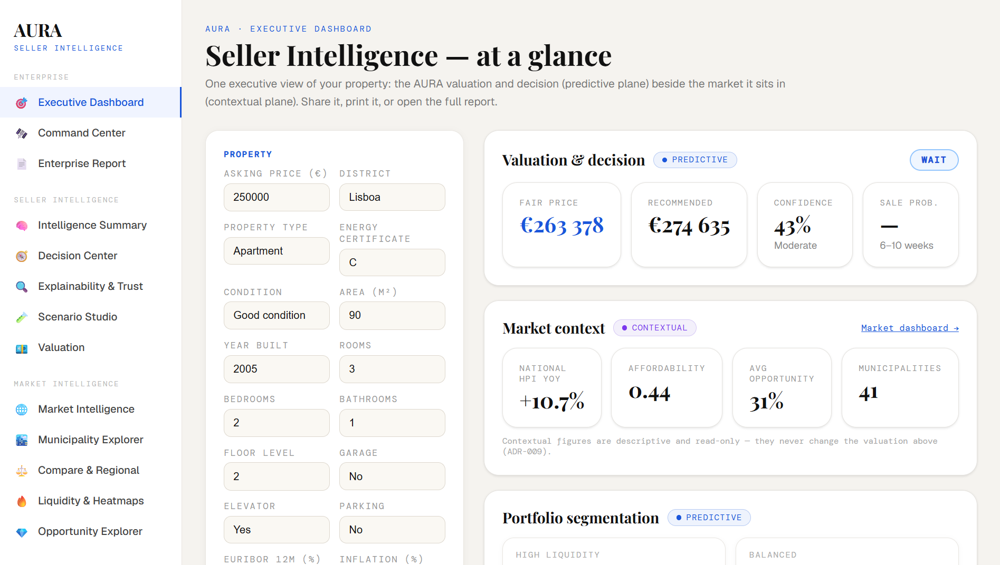

# AURA Ecosystem

### Adaptive Unified Real Estate Intelligence Engine

> **An enterprise-grade AI-powered real estate intelligence ecosystem that combines artificial intelligence, explainable machine learning, market intelligence, and decision-support systems to improve transparency, valuation accuracy, and strategic decision-making within the Portuguese real estate market.**

<p align="center">

**Software Engineering Capstone • Artificial Intelligence • PropTech • Explainable AI • Decision Support Systems**

</p>

---

## 🎬 Official Demonstration

<p align="center">
  <a href="https://www.youtube.com/watch?v=7xLjv7RZoCM" target="_blank">
    
  </a>
</p>

<p align="center">
  <strong>▶ Click the image above to watch the official AURA Ecosystem demonstration</strong>
</p>

---

# Vision

Traditional real estate platforms primarily function as listing portals, offering property advertisements with limited analytical value. They rarely explain **why** a property should be purchased, **how** market conditions influence valuation, or **which** hidden risks may affect an investment.

The **Adaptive Unified Real Estate Intelligence Engine (AURA)** was designed to bridge this information gap by transforming fragmented property data into transparent, explainable, and actionable intelligence.

Rather than estimating prices alone, AURA delivers:

* Explainable Property Valuation
* Market Intelligence
* Spatial Intelligence
* Risk Assessment
* Investment Insights
* AI-assisted Decision Support
* Confidence-aware Recommendations

The ecosystem was developed during a Software Engineering Capstone in collaboration with **FAIRBANK**, a Portuguese PropTech company, and follows modern Artificial Intelligence, Explainable AI (XAI), Design Science Research, and Software Engineering principles.  

---

# The Problem

Real estate remains one of the largest financial investments individuals and organizations make.

Despite this:

* Property information is fragmented across disconnected systems.
* Listing prices rarely represent true market value.
* Hidden structural and regulatory risks remain difficult to identify.
* Investment decisions frequently rely on incomplete information.
* Traditional valuation systems provide little transparency regarding their predictions.

These limitations contribute to **information asymmetry**, increasing uncertainty for buyers, sellers, investors, and real estate professionals. AURA addresses this challenge through an integrated, explainable, AI-driven decision-support ecosystem.  

---

# Ecosystem Overview

AURA is composed of three interconnected products, each responsible for a distinct intelligence layer.

```text
                         AURA ECOSYSTEM

                    ┌──────────────────────┐
                    │  Product 1           │
                    │  AURA AI Platform    │
                    │ Intelligence Engine  │
                    └──────────┬───────────┘
                               │
                               ▼
                    ┌──────────────────────┐
                    │ Product 2            │
                    │ AURA AI Assistant    │
                    │ Explainable AI Layer │
                    └──────────┬───────────┘
                               │
                               ▼
                    ┌──────────────────────┐
                    │ Product 3            │
                    │ Intelligence Hub     │
                    │ Executive Analytics  │
                    └──────────────────────┘
```

Each product can operate independently while contributing to a unified intelligence infrastructure.

---

# Product Portfolio

## Product 1 — AURA AI Platform

The analytical core responsible for transforming heterogeneous datasets into structured intelligence.

### Capabilities

* Multi-source Data Integration
* Property Valuation
* Spatial Intelligence
* Market Intelligence
* Tourism Intelligence
* Volatility Analysis
* Feature Engineering
* Confidence Management
* Explainable Machine Learning
* Risk Assessment
* Governance Framework

---

## Product 2 — AURA AI Assistant

An intelligent assistant capable of transforming analytical outputs into explainable natural-language insights.

### Features

* Explainable AI
* Natural Language Interaction
* Context-Aware Reasoning
* Market Interpretation
* Investment Recommendations
* Confidence Explanation
* Risk Summarization
* Human-readable Decision Support

---

## Product 3 — Intelligence Hub

A modern executive dashboard designed for strategic decision-making.

### Features

* Executive Dashboard
* Portfolio Analytics
* Municipality Comparison
* Watchlists
* Opportunity Analysis
* Decision Memory
* Market Intelligence
* Interactive Analytics
* Executive Reporting

---

# Core Capabilities

The AURA ecosystem combines multiple intelligence domains within a unified platform.

## Artificial Intelligence

* Explainable AI (XAI)
* Machine Learning
* AI-assisted Decision Support
* Confidence-aware Predictions
* Intelligent Recommendations

## Data Intelligence

* Multi-source Data Integration
* Feature Engineering
* Data Governance
* Market Intelligence
* Geospatial Intelligence

## Real Estate Intelligence

* Automated Valuation
* Market Analysis
* Investment Analysis
* Risk Detection
* Scenario Analysis
* Opportunity Identification

## Executive Intelligence

* Portfolio Monitoring
* Executive Dashboards
* Municipality Benchmarking
* Strategic Reporting
* Decision Analytics

---

# System Architecture

The ecosystem follows a layered enterprise architecture.

```text
Presentation Layer
        │
        ▼
Executive Intelligence Layer
        │
        ▼
AI Assistant Layer
        │
        ▼
Decision Support Layer
        │
        ▼
Intelligence Layer
        │
        ▼
Data Layer
```

This separation improves scalability, maintainability, governance, and future extensibility.

---

# Technology Stack

## Frontend

* React
* TypeScript
* Vite
* Tailwind CSS
* React Query
* Zustand

## Backend

* Python
* FastAPI
* Polars
* Pydantic

## Artificial Intelligence

* Explainable AI (XAI)
* SHAP
* Machine Learning
* Large Language Models
* Retrieval-Augmented Generation (RAG)

## Data Engineering

* CSV Intelligence Layers
* Geospatial Analytics
* Market Intelligence
* Tourism Intelligence
* Volatility Intelligence

---

# Software Engineering Principles

The project follows modern engineering practices.

* Modular Architecture
* Domain-driven Separation
* Layered System Design
* Explainability
* Confidence Management
* Governance
* API-first Design
* Scalable Infrastructure
* Production-oriented Development

---

# Engineering Evolution

The ecosystem evolved through multiple engineering iterations.

```text
Research
      │
      ▼
Data Foundation
      │
      ▼
Platform Development
      │
      ▼
Enterprise Intelligence
      │
      ▼
AI Assistant
      │
      ▼
Executive Intelligence Hub
      │
      ▼
Complete AURA Ecosystem
```

Each stage introduced new capabilities while preserving architectural consistency.

---

# Research Foundation

The project was developed using **Design Science Research Methodology (DSRM)** and is grounded in research across:

* Artificial Intelligence
* Explainable AI
* Property Technology (PropTech)
* Decision Support Systems
* Machine Learning
* Geospatial Analytics
* Data Integration
* Risk Analysis
* Market Intelligence

The academic work investigates how intelligent decision-support systems can reduce information asymmetry and improve transparency in the Portuguese real estate market. 

---

# Repository Structure

```text
AURA-Ecosystem
│
├── README.md
│
└── Aura Reports
    ├── 01_Research_And_Foundation_Report
    ├── 02_Product_1_Aura_AI_Platform_Report
    ├── 03_Product_2_AURA_AI_Assistant_Report
    ├── 04_Product_3_Intelligence_Hub_Report
    ├── 05_Dataset_Reports
    ├── Capstone Chapters Figures
    ├── AURA_MASTER_ENGINEERING_REPORT.md
    └── ITERATION1_ENGINEERING_BLUEPRINT.md
```

---

# Engineering Documentation

This repository contains the complete engineering documentation produced throughout the project lifecycle, including:

* Research Reports
* Architecture Reports
* Engineering Blueprints
* Dataset Evolution
* Product Evolution
* Technical Reports
* Design Iterations
* Validation Reports
* System Architecture Documentation
* Final Engineering Artifacts

Together, these documents capture the evolution of AURA from its initial research phase to a production-oriented AI ecosystem.

---

# Academic Information

| Item                   | Details                                                 |
| ---------------------- | ------------------------------------------------------- |
| Project                | Adaptive Unified Real Estate Intelligence Engine (AURA) |
| Institution            | Mediterranean Institute of Technology (MedTech)         |
| Industry Partner       | FAIRBANK                                                |
| Academic Supervisor    | Dr. Abdeldjalil Labed                                   |
| Institution Supervisor | Mr. Pieter Paul Castelein                               |
| Academic Year          | 2025–2026                                               |
| Author                 | Achref Elarbi                                           |

The capstone presents the complete research, methodology, implementation, validation, and evaluation of the AURA ecosystem. 

---

# Future Roadmap

Planned directions include:

* Real-time market intelligence
* Cloud-native deployment
* Enterprise integrations
* Advanced forecasting
* Portfolio optimization
* Multi-agent AI collaboration
* Expanded explainability
* International market support

---

# Disclaimer

This repository serves as the **public engineering and research showcase** for the AURA Ecosystem.

It contains engineering documentation, research artifacts, technical reports, architectural designs, and supporting material produced throughout the project's development.

The implementation source code for the individual products is maintained separately.

---

# Citation


> **Achref Elarbi.** *Adaptive Unified Real Estate Intelligence Engine (AURA): AI-Driven Real Estate Intelligence Infrastructure for Valuation and Decision-Making.* Mediterranean Institute of Technology (MedTech), 2025–2026. 

